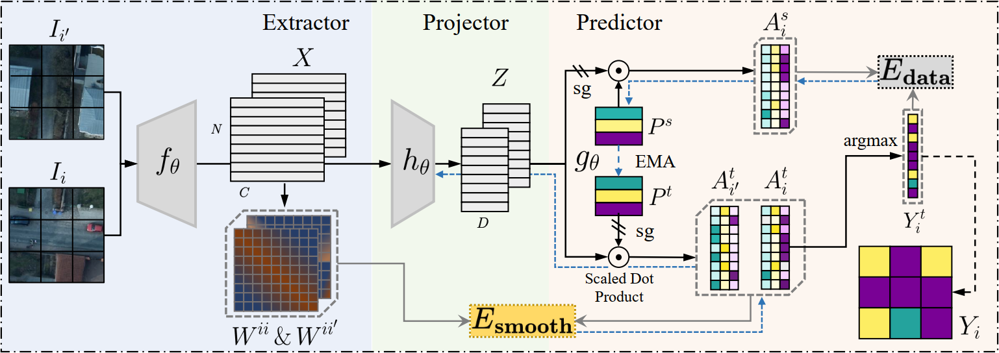

<div align="center">

<h1>SmooSeg: Smoothness Prior for Unsupervised Semantic Segmentation</h1>

<div>
    <a href='https://mc-lan.github.io/' target='_blank'>Mengcheng Lan</a><sup>1</sup>&emsp;
    <a href='https://scholar.google.com.hk/citations?user=q4lnWaoAAAAJ&hl=en&inst=8669986779262753491&oi=ao' target='_blank'>Xinjiang Wang</a><sup>3</sup>&emsp;
    <a href='https://keyiping.wixsite.com/index' target='_blank'>Yiping Ke</a><sup>2</sup>&emsp;
    <a href='https://angusmonroe.cn/' target='_blank'>Jiaxing Xu</a><sup>2</sup>&emsp;
    <a href='https://scholar.google.com.hk/citations?user=PnNAAasAAAAJ&hl=en' target='_blank'>Litong Feng</a><sup>3</sup>&emsp;
    <a href='https://scholar.google.com.hk/citations?user=5GtyVooAAAAJ&hl=en&inst=8669986779262753491&oi=ao' target='_blank'>Wayne Zhang</a><sup>3</sup>&emsp;
</div>
<div>
    <sup>1</sup>S-Lab, Nanyang Technological University&emsp; 
    <sup>2</sup>SCSE, Nanyang Technological University&emsp; 
    <sup>3</sup>SenseTime Research&emsp;
</div>

<div>
    <strong>Accepted to NeurIPS 2023</strong>
</div>

<div>
    <h4 align="center">
        • <a href="https://arxiv.org/abs/2310.17874" target='_blank'>[arXiv]</a> •
    </h4>
</div>



</div>

## Abstract
> *Unsupervised semantic segmentation is a challenging task that segments images into semantic groups without manual annotation. 
Prior works have primarily focused on leveraging prior knowledge of semantic consistency or priori concepts from self-supervised learning methods, which often overlook the coherence property of image segments. 
In this paper, we demonstrate that the smoothness prior, asserting that close features in a metric space share the same semantics, can significantly simplify segmentation by casting unsupervised semantic segmentation as an energy minimization problem. 
Under this paradigm, we propose a novel approach called SmooSeg that harnesses self-supervised learning methods to model the closeness relationships among observations as smoothness signals. 
To effectively discover coherent semantic segments, we introduce a novel smoothness loss that promotes piecewise smoothness within segments while preserving discontinuities across different segments. 
Additionally, to further enhance segmentation quality, we design an asymmetric teacher-student style predictor that generates smoothly updated pseudo labels, facilitating an optimal fit between observations and labeling outputs. 
Thanks to the rich supervision cues of the smoothness prior, our SmooSeg significantly outperforms STEGO in terms of pixel accuracy on three datasets: COCOStuff (+14.9%), Cityscapes (+13.0%), and Potsdam-3 (+5.7%).*


## Codes and Environment

```
# git clone this repository
git clone https://github.com/mc-lan/SmooSeg.git
cd SmooSeg

# create new anaconda env
conda create -n SmooSeg python=3.10
conda activate SmooSeg

# install pytorch
Install an appropriate pytorch version according to your cuda version. For example:
pip install torch==1.12.1+cu116 torchvision==0.13.1+cu116 torchaudio==0.12.1 --extra-index-url https://download.pytorch.org/whl/cu116

# install python dependencies
pip install -r requirements.txt
```

### Prepare Datasets
Change the `data_dir` variable to your data directory where datasets are stored.

```shell script
python download_datasets.py

cd /YOUR/PYTORCH/DATA/DIR
unzip cocostuff.zip
unzip cityscapes.zip
unzip potsdam.zip
unzip potsdamraw.zip

python crop_datasets.py
```

### Checkpoints
Download the checkpoints from [[Google Drive](https://drive.google.com/drive/folders/1DueMGFkN6p1RvCxym5BpxsOdm2q3tSCl?usp=drive_link) | [BaiduPan (pw: 2pqh)](https://pan.baidu.com/s/1rK8L7uHmaE5Vun4yLnnL5g?pwd=2pqh)] to `checkpoints` folder.

### Model training
Hyperparameters can be modified in [`SmooSeg/configs/train_config.yaml`](configs/train_config.yaml).
```shell script
CUDA_VISIBLE_DEVICES="0" python train_segmentation.py
```

### Model evaluation
Some parameters `model_paths` and `data_dir` should be modified in [`SmooSeg/configs/eval_config.yaml`](configs/eval_config.yaml).
```shell script
python eval_segmentation.py
```

## Citation
```
@misc{lan2023smooseg,
      title={SmooSeg: Smoothness Prior for Unsupervised Semantic Segmentation}, 
      author={Mengcheng Lan and Xinjiang Wang and Yiping Ke and Jiaxing Xu and Litong Feng and Wayne Zhang},
      year={2023},
      eprint={2310.17874},
      archivePrefix={arXiv},
      primaryClass={cs.CV}
}
```
```
@inproceedings{lan2023smooseg,
      title={SmooSeg: Smoothness Prior for Unsupervised Semantic Segmentation}, 
      author={Mengcheng Lan and Xinjiang Wang and Yiping Ke and Jiaxing Xu and Litong Feng and Wayne Zhang},
      booktitle={NeurIPS},
      year={2023},
}
```

## License
This project is licensed under <a rel="license" href="https://github.com/mc-lan/SmooSeg/blob/master/LICENSE">NTU S-Lab License 1.0</a>. Redistribution and use should follow this license.


## Acknowledgement
This study is supported under the RIE2020 Industry Alignment Fund – Industry Collaboration Projects (IAF-ICP) Funding Initiative, as well as cash and in-kind contribution from the industry partner(s), by the National Research Foundation, Singapore under its Industry Alignment Fund – Pre-positioning (IAF-PP) Funding Initiative, and by the Ministry of Education, Singapore under its MOE Academic Research Fund Tier 2 (STEM RIE2025 Award MOE-T2EP20220-0006).

This implementation is based on [STEGO](https://github.com/mhamilton723/STEGO/tree/master). Thanks for the awesome work.

## Contact
If you have any questions, please feel free to reach out at `lanm0002@e.ntu.edu.sg`.